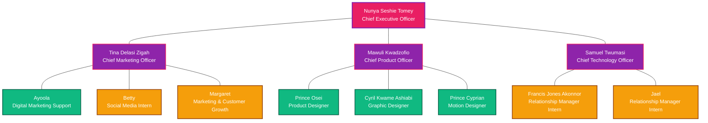
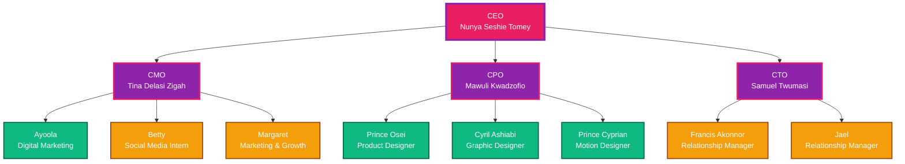
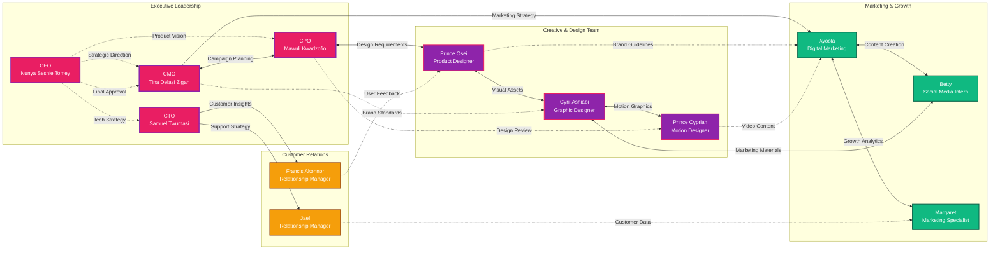

# TWiST Beauty Team Structure - Mermaid Charts

This repository contains interactive Mermaid.js organizational charts for TWiST Beauty's team structure. These charts can be imported and used in GitHub, documentation, or any Mermaid-compatible platform.

## 📊 Available Charts

### 1. Organization Overview
Complete organizational structure showing all team members and their relationships.



### 2. Reporting Structure
Clear hierarchy showing direct reporting relationships.



### 3. Communication Flows & Role Interactions
Interactive diagram showing how team members collaborate, communicate, and share responsibilities across departments.



## 🎨 Color Coding System

| Role Level | Color | Description |
|------------|-------|-------------|
| **CEO** | Pink (#E91E63) | Chief Executive Leadership |
| **C-Suite** | Purple (#8E24AA) | Chief Marketing, Product, Technology Officers |
| **Core Team** | Green (#10B981) | Product Designers, Marketing Specialists |
| **Interns** | Orange (#F59E0B) | Relationship Managers, Social Media Interns |

## 📋 Communication Legend

| Symbol | Meaning |
|--------|---------|
| `-->` | Direct Reports & Strategy |
| `-.->` | Collaboration & Feedback |
| `<-->` | Two-way Communication |

## 🚀 Usage Instructions

### GitHub Integration
1. Copy any chart code block from above
2. Paste into your GitHub README.md or documentation
3. The chart will render automatically in GitHub's Mermaid support

### Documentation Sites
- **GitBook**: Supports Mermaid charts natively
- **Notion**: Use Mermaid code blocks
- **Confluence**: Install Mermaid plugin
- **GitLab**: Native Mermaid support in markdown

### Development Environments
```html
<!-- Include Mermaid.js in your HTML -->
<script src="https://cdn.jsdelivr.net/npm/mermaid@10.6.1/dist/mermaid.min.js"></script>

<!-- Chart container -->
<div class="mermaid">
  <!-- Paste chart code here -->
</div>

<!-- Initialize -->
<script>
  mermaid.initialize({
    startOnLoad: true,
    theme: 'base',
    themeVariables: {
      primaryColor: '#E91E63',
      primaryTextColor: '#ffffff',
      primaryBorderColor: '#8E24AA'
    }
  });
</script>
```

## 📁 Team Structure Summary

### Executive Leadership (4 members)
- **CEO**: Nunya Seshie Tomey - Overall strategy and leadership
- **CMO**: Tina Delasi Zigah - Marketing and brand strategy
- **CPO**: Mawuli Kwadzofio - Product development and design oversight
- **CTO**: Samuel Twumasi - Technology and customer relations

### Core Team (4 members)
- **Product Designer**: Prince Osei - UI/UX and product design
- **Graphic Designer**: Cyril Kwame Ashiabi - Visual identity and graphics
- **Motion Designer**: Prince Cyprian - Animation and motion graphics
- **Digital Marketing**: Ayoola - Online marketing and campaigns

### Interns & Growth (4 members)
- **Social Media Intern**: Betty - Social media management
- **Relationship Manager**: Francis Jones Akonnor - Customer relationships
- **Relationship Manager**: Jael - Customer support and engagement
- **Marketing & Growth**: Margaret - Marketing analysis and growth strategies

### Support Members (8 members)
Part-time contributors: Doreen, Jude, Rosalinda, Jessica, Mimi, Ella, Louis, Mavelli

## 🔗 Key Cross-functional Areas

1. **Brand & Creative Alignment**: CMO → CPO → Design Team
2. **Product-Marketing Bridge**: Product Designers ↔ Marketing Team
3. **Customer Feedback Loop**: Relationship Managers → Product/Marketing
4. **Content Creation Pipeline**: Design → Motion → Marketing Distribution

## 📞 Contact & Updates

For questions about team structure or chart updates, contact the executive team through official TWiST Beauty channels.

Last updated: January 2024